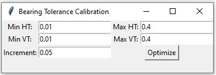

# Bearing Binary Search

GUI app to find find bearing tolerances using a simple binary search algorythm

Mostly created by ChatGPT.
Packaged to executable via pyinstaller.

## Usage

- HT - Horizontal Tolerance
- VT - Vertical Tolerance
- Increment - Steps from Min values to Max values

Minimal values are kinda funky currently, basically they are not inclusive. So set them to a slightly smaller values, than your actual min values.
After hitting "Optimize" a new window appears, asking if the printed version does work. After answering a new HT-VT set is checked until everyting is optimized.
To abort the process just hit "yes" or "no" as long, as it stops :D. The nice thing currently is, that you can retrace your steps. So if you want to get to your last step, just hit "yes" and "no" in the same way.
